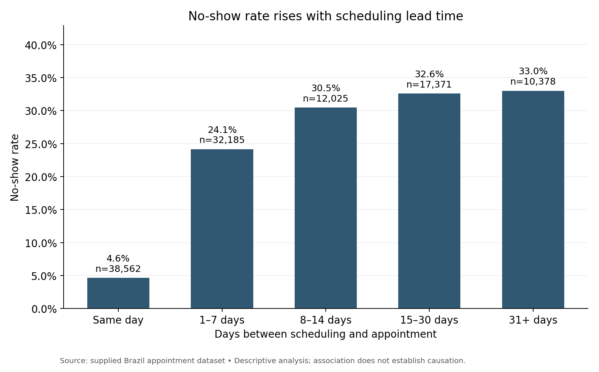
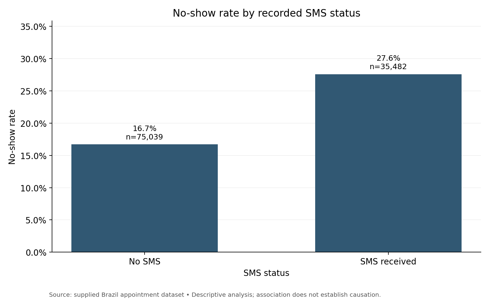
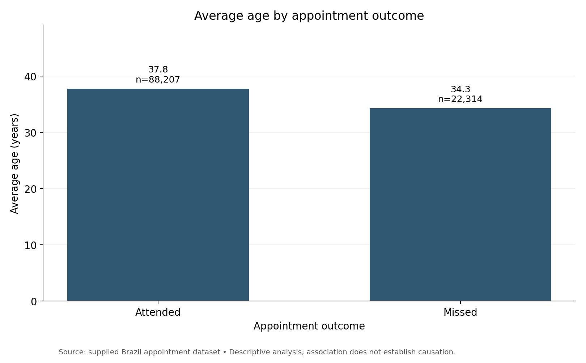

# Medical Appointment No-Shows

**Lamiae Abbouyat · Python exploratory data analysis**  
Python · pandas · NumPy · Matplotlib · Jupyter

## Overview

I analyzed 110,527 appointment records from Brazil to explore how SMS status, age, and scheduling lead time relate to missed appointments. After removing six invalid records, the analysis covers **110,521 appointments**. This is a portfolio edition of my Udacity *Investigate a Dataset* project.

## Questions

1. How do no-show rates differ by recorded SMS status?
2. How does average age differ between attended and missed appointments?
3. How do no-show rates vary with the time between booking and the appointment?

## Findings

| Comparison | Result |
|---|---|
| No SMS / SMS received | 16.7% / 27.6% no-show rate |
| Attended / missed appointments | 37.8 / 34.3 years average age |
| Same-day / 31+ days ahead | 4.6% / 33.0% no-show rate |
| Attended / missed appointments | 8.8 / 15.8 days average scheduling lead time |



The grouped lead-time comparison shows an increasing no-show rate. It does not show that reducing lead time would itself reduce missed appointments. Similarly, the SMS comparison does not establish whether reminders helped or harmed attendance.





## Methods and data quality

- Checked dimensions, data types, missingness, and duplicate rows; no missing values or exact duplicate rows were found.
- Standardized column names and converted dates to datetime.
- Removed one record with age −1 and five records with negative scheduling lead time.
- Mapped `No-show = Yes` to `missed = 1`; `No` means attended.
- Normalized both dates before subtracting, so same-day bookings remain zero days regardless of booking time.
- Calculated group counts, missed-appointment counts, proportions, and descriptive age statistics.
- Retained identifiers as strings; validated unique appointment IDs and reconciled row counts.

The unit of analysis is an appointment, not a unique patient. No-show rates are missed appointments divided by all appointments in each group.

## Interpretation and limitations

This is descriptive, observational analysis. Reminder timing and targeting are unknown; appointment purpose, transport access, and other contextual factors are unavailable. Repeat visits by the same patient may be related. Average ages do not establish age-specific risk. No significance tests, causal estimates, predictive accuracy, or operational improvements are claimed.

Useful follow-up questions include whether the SMS association persists within lead-time groups and whether confirmation or easier rescheduling could help appointments booked far ahead. These are hypotheses to test, not proven interventions. Regression could examine adjusted associations but would not by itself establish causality.

## Explore the project

- [Executed notebook](notebooks/medical_appointment_no_shows_analysis.ipynb)
- [HTML report](Medical_Appointment_No_Shows_Report.html) — download and open in a browser
- `images/` — three exported charts
- `results/` — aggregate summary tables and data checksum
- `data/README.md` — input and provenance notes

## Reproduce

Use Python 3.12, the version used for verification. From this project folder:

```bash
python -m pip install -r requirements.txt
python -m notebook
```

Open `notebooks/medical_appointment_no_shows_analysis.ipynb`, then restart the kernel and run all cells. The notebook supports a working directory of either the project root or `notebooks/`. It recreates the charts and result tables. Install the matching CSV in `data/` if it is not present.

## Skills demonstrated

Data quality assessment, datetime handling, feature engineering, pandas aggregation, reusable chart functions, and communicating findings with appropriate limitations.
